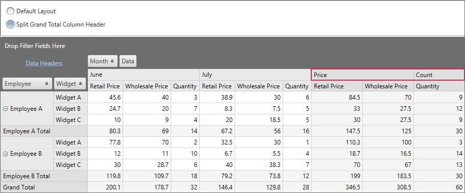

<!-- default badges list -->

<!-- default badges end -->

# Pivot Grid for WPF - Split Field Value Cells

The following example demonstrates how to split field value cells. In this example, the Grand Total column header is split into two cells: _Price_ and _Count_.

Handle the [CustomFieldValueCells](https://docs.devexpress.com/WPF/DevExpress.Xpf.PivotGrid.PivotGridControl.CustomFieldValueCells?p=netframework) event and call the event parameter's `Split` method. Cells that should be split are identified by a predicate that returns true for those cells. The quantity, size, and captions of newly created cells are specified by an array of cell definitions (the `FieldValueSplitData` objects).

## Files to Review

* [Window1.xaml](./CS/Window1.xaml) (VB: [Window1.xaml](./VB/Window1.xaml))
* [Window1.xaml.cs](./CS/Window1.xaml.cs) (VB: [Window1.xaml.vb](./VB/Window1.xaml.vb))

## More Examples 

[Pivot Grid for WPF - How to Hide Specific Rows and Columns](https://github.com/DevExpress-Examples/wpf-pivot-grid-hide-specific-columns-and-row)
